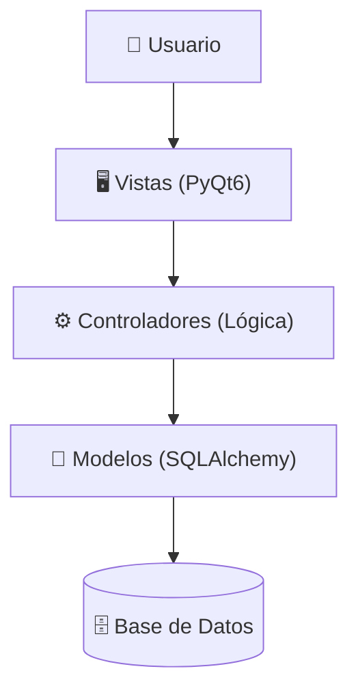

<div align="center">
  

  # METIN FORGE
  
  **Tu Centro de Comando para la Gestión de Cuentas en Metin2**
  
  Gestor avanzado de alquimia, pesca, tómbola y temporizadores para optimizar tu "farming" diario.

  <br />

  [](https://www.python.org/)
  [](https://pypi.org/project/PyQt6/)
  [](https://www.sqlalchemy.org/)
  [](LICENSE)

</div>

<br />

## 📋 Tabla de Contenidos
- [📖 Sobre el Proyecto](#-sobre-el-proyecto)
- [🚀 Características Principales](#-características-principales)
- [🛠 Arquitectura del Sistema](#-arquitectura-del-sistema)
- [💻 Stack Tecnológico](#-stack-tecnológico)
- [⚙️ Instalación y Configuración](#%EF%B8%8F-instalación-y-configuración)
- [⌨️ Atajos de Teclado](#%EF%B8%8F-atajos-de-teclado)
- [🤝 Contribución](#-contribución)

---

## 📖 Sobre el Proyecto

**MetinForge** es una aplicación de escritorio diseñada para jugadores hardcore de Metin2 que gestionan múltiples cuentas ("Farmers"). El proyecto nace de la necesidad de centralizar el seguimiento de actividades repetitivas que el juego no trackea nativamente.

A diferencia de un Excel tradicional, MetinForge ofrece una interfaz visual interactiva (GUI), persistencia en base de datos y herramientas de automatización de registros (Batch Actions), permitiendo gestionar cientos de personajes sin perder el control de tus **Cors (Alquimia)**, **Pesca** o eventos de **Tómbola**.

---

## 🚀 Características Principales

### 💎 Gestión de Alquimia (Draconis)
- **Grid Visual Diario:** Panel estilo calendario para marcar el estado de la misión diaria (✅ Hecho, ❌ Fallido, ⬜ Pendiente).
- **Contadores de Piedras:** Inventario global de alquimias (Diamante, Rubí, Jade, etc.) por jornada.
- **Cálculo de Cords:** Registro de fragmentos/cords obtenidos por cuenta.

### 🎣 Módulo de Pesca
- **Registro Anual:** Vista macroscópica dividida por Meses y Semanas.
- **Seguimiento de Pescadores:** Control de actividad específico para personajes tipo "Fisherman".

### 🎰 Eventos y Tómbola
- **Gestión de Jornadas:** Crea eventos personalizados (ej. "Evento Navidad", "Tómbola Verano").
- **Histórico:** Mantén un registro separado de actividades por evento.

### ⏱️ Utilidades Extra
- **Floating Timer:** Cronómetro "Always-on-top" para medir tiempos de Dungeons o Spawns de Jefes.
- **Importación Masiva:** Carga cientos de cuentas desde archivos `.xlsx` o `.csv` en segundos.
- **Multi-Server:** Soporte para gestionar cuentas en diferentes servidores (ej. Safiro, Rubi) con configuraciones independientes.

---

## 🛠 Arquitectura del Sistema

El proyecto sigue un patrón de diseño **MVC (Modelo-Vista-Controlador)** estricto para garantizar la escalabilidad y el mantenimiento.



* **Models (`app/models`):** Definiciones ORM de `StoreAccount`, `GameAccount`, `Character`, `Activities`.
* **Controllers (`app/controllers`):** Lógica de negocio. Ej: `AlchemyController` gestiona la lógica de días pendientes y estados.
* **Views (`app/views`):** Interfaz gráfica construida con componentes reutilizables (`DailyGrid`, `AlchemyRow`).

---

## 💻 Stack Tecnológico

| Componente | Tecnología | Descripción |
| --- | --- | --- |
| **Lenguaje** | Python | Núcleo del desarrollo. |
| **GUI** | PyQt6 | Framework para la interfaz de escritorio. |
| **Base de Datos** | SQLAlchemy + PyMySQL | ORM agnóstico (MySQL en Prod, SQLite en Test). |
| **Estilos** | QSS (Qt Style Sheets) | Tema visual personalizado "Metin2 Dark Gold". |
| **Testing** | Pytest | Tests unitarios, de integración y E2E. |

---

## ⚙️ Instalación y Configuración

### Prerrequisitos

* Python 3.9 o superior.
* MySQL Server (Opcional, configurable a SQLite).

### Pasos

1. **Clonar el repositorio**
```bash
git clone [https://github.com/martin-ratti/MetinForge.git](https://github.com/martin-ratti/MetinForge.git)
cd MetinForge

```


2. **Crear entorno virtual**
```bash
python -m venv venv
# Windows
.\venv\Scripts\activate
# Linux/Mac
source venv/bin/activate

```


3. **Instalar dependencias**
```bash
pip install -r requirements.txt

```


4. **Configurar Variables de Entorno**
Crea un archivo `.env` en la raíz (básate en el código de `app/utils/config.py`):
```env
DB_USER=root
DB_PASSWORD=tu_password
DB_HOST=localhost
DB_PORT=3306
DB_NAME=metin_manager_db

```


5. **Inicializar Base de Datos**
```bash
python -m app.models.database_setup
# Opcional: Sembrar datos de prueba
python -m app.utils.seed_data

```


6. **Ejecutar la Aplicación**
```bash
python -m app.main

```


---

## ⌨️ Atajos de Teclado

Para maximizar la eficiencia ("Productivity First"), la aplicación soporta acciones en lote (Batch Actions):

| Atajo | Acción | Contexto |
| --- | --- | --- |
| `Ctrl + A` | **Seleccionar Todo** | Marca todas las filas visibles. |
| `Ctrl + D` | **Deseleccionar** | Limpia la selección actual. |
| `1` | **Marcar HECHO (✅)** | Marca el siguiente día pendiente como completado en las filas seleccionadas. |
| `2` | **Marcar FALLIDO (❌)** | Marca el siguiente día como fallido. |
| `3` | **RESET (♻️)** | Reinicia el último estado o resetea el día. |
| `Shift + Click` | **Rango** | Selección múltiple de cuentas consecutivas. |

---

## 🤝 Contribución

1. Haz un Fork del proyecto.
2. Crea tu rama de funcionalidad (`git checkout -b feature/AmazingFeature`).
3. **IMPORTANTE:** Asegúrate de seguir la regla de integridad (`.agent/rules/tets-rules.md`):
* Si creas código nuevo, **debes** crear un test asociado.
* Ejecuta `pytest` antes de hacer commit.


4. Haz Commit de tus cambios (`git commit -m 'Add some AmazingFeature'`).
5. Haz Push a la rama (`git push origin feature/AmazingFeature`).
6. Abre un Pull Request.

---

<div align="center">
<small>Desarrollado con ❤️ y mucho café por Martín Ratti</small>
</div>

